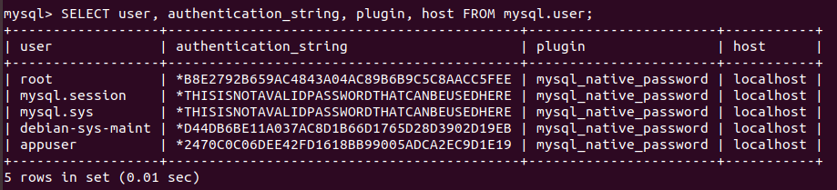

<h3>DATABASE</h3>


<b>Installation</b>

1. Update local system:

```sh
sudo apt update
```

2. Install the MySQL package with the following command:

```sh
sudo apt install mysql-server
```

3. Once the installation is completed, the MySQL service will start automatically. To check whether the MySQL server is running:

```sh
sudo systemctl status mysql
```


4. Run MySQL terminal:

```sh
sudo mysql
```
<br/>

<b>Grant new user access to MySQL</b>

1. Change the authentication method from auth_socket to mysql_native_password:

```sh
ALTER USER 'root'@'localhost' IDENTIFIED WITH mysql_native_password BY 'very_strong_password';
FLUSH PRIVILEGES;
```

2. Create new user with administrator rights to access to all databases:

```sh
GRANT ALL PRIVILEGES ON *.* TO 'appuser'@'localhost' IDENTIFIED BY 'very_strong_password';
```


3. Change password for new user. For older versions of MySQL,

```sh
UPDATE mysql.user SET Password=PASSWORD('mynewpassword') WHERE User='appuser';
FLUSH PRIVILEGS;
```
For new versions of MySQL,
```sh
UPDATE mysql.user SET authentication_string=password('mynewpassword') WHERE User='appuser';
FLUSH PRIVILEGS;
```
where 'mynewpassword' is to be replaced with your new password. In our case, mynewpassword is set be be 'password'.

4. Exit MySQL:

```sh
EXIT;
```
<br/>

<b>Import .sql file to MySQL</b>

1. Login MySQL with new password as password:

```sh
mysql -u appuser -p
```

2. Run the script with full path:

```sh
mysql> /home/knife/Desktop/Knife/UI_Portal/DB/Demo2DB.sql;
```

3. Show databases. Ensure Demo2DB is listed.

```sh
SHOW DATABASES;
```

4. Use database, Demo2DB:

```sh
USE Demo2DB;
```

5. Show all tables of database, Demo2DB:

```sh
SHOW tables;
```
