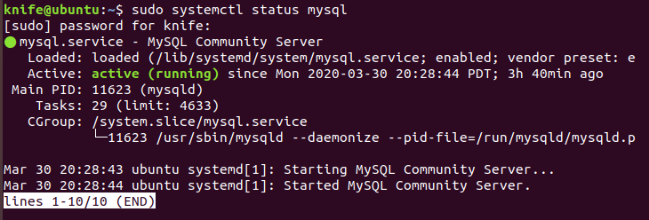

<h4>DATABASE</h4>

<h5>Installation</h5>
1. Update local system:

```sh
sudo apt update
```

2. Install the MySQL package with the following command:

```sh
sudo apt install mysql-server
```

3. Once the installation is completed, the MySQL service will start automatically. To check whether the MySQL server is running:

```sh
sudo systemctl status mysql
```


4. 
